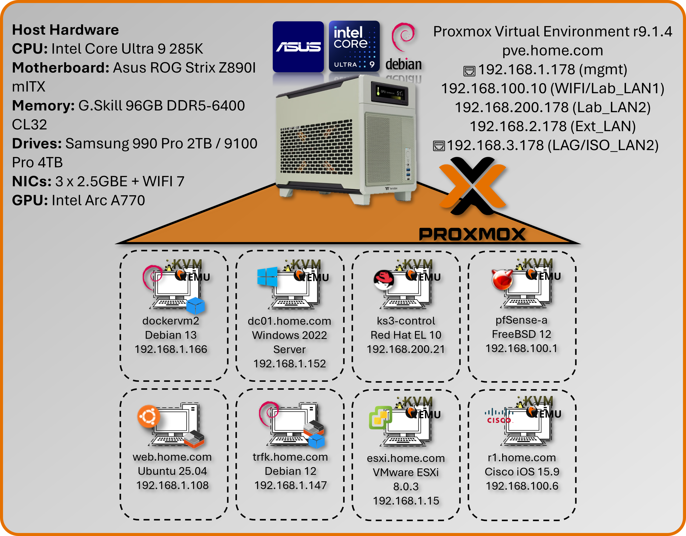

# Infrastructure, Platform and Hardware Summary

**Document Control:**   
Version: 1.2  
Last Updated: March 11, 2026  
Owner: Paul Leone 

---
## Core Virtualization Stack

### Proxmox Virtual Environment (VE)

#### Deployment Overview

<div class="two-col-right">
  <div class="text-col">
    <p>
      The lab's foundation is a single-node Proxmox Virtual Environment (VE) cluster running on enterprise-class bare-metal hardware, serving as the Type-1 hypervisor for the entire security operations platform. Proxmox provides KVM-based full virtualization for operating systems (Windows, BSD, Linux, MacOS) and LXC containerization for lightweight Linux workloads. The platform hosts approximately 30+ concurrent virtual machines and containers, supporting everything from high-availability pfSense firewalls to Kubernetes clusters, SIEM platforms, and malware analysis environments. Automated backup infrastructure via Proxmox Backup Server ensures rapid disaster recovery, while Proxmox Datacenter Manager provides centralized orchestration and monitoring.
    </p>
  </div>

  <div class="image-col">
    <figure>
      
      <figcaption style="font-size:0.9rem; color:var(--md-secondary-text-color); margin-top:0.5rem;">
        Proxmox VE single-node cluster and hosted services.
      </figcaption>
    </figure>
  </div>
</div>
<!-- {.float-right width=60%}
The lab's foundation is a single-node Proxmox Virtual Environment (VE) cluster running on enterprise-class bare-metal hardware, serving as the Type-1 hypervisor for the entire security operations platform. Proxmox provides KVM-based full virtualization for operating systems (Windows, BSD, Linux, MacOS) and LXC containerization for lightweight Linux workloads. The platform hosts approximately 30+ concurrent virtual machines and containers, supporting everything from high-availability pfSense firewalls to Kubernetes clusters, SIEM platforms, and malware analysis environments. Automated backup infrastructure via Proxmox Backup Server ensures rapid disaster recovery, while Proxmox Datacenter Manager provides centralized orchestration and monitoring. -->
 
#### Security Impact

- Bare-metal Type-1 hypervisor minimizes attack surface compared to Type-2 hosted solutions
- KVM hardware-assisted virtualization provides strong isolation between tenant workloads
- LXC containerization delivers near-native performance for network services with reduced overhead
- Snapshot and backup capabilities enable rapid rollback after security testing or compromise
- Centralized management reduces configuration drift and unauthorized system modifications
- ZFS storage backend provides data integrity verification and encryption at rest
- Network segmentation via virtual bridges isolates security zones (management, production, DMZ)

#### Deployment Rationale

Proxmox VE mirrors enterprise virtualization platforms (VMware vSphere, Microsoft Hyper-V, Red Hat Virtualization) while providing open-source flexibility and zero licensing costs. This enables building an enterprise-scale lab environment demonstrating production-grade infrastructure without commercial hypervisor expenses. Proxmox's integrated backup solution, clustering capabilities, and API-driven automation align with modern Infrastructure as Code (IaC) practices used in DevSecOps environments. The platform supports Docker and Kubernetes workloads alongside traditional VMs, demonstrating hybrid cloud architecture patterns increasingly common in enterprise security operations.

#### Architecture Principles Alignment

**Defense in Depth:**

- Hypervisor layer enforces hardware-based isolation between security zones
- Virtual network bridges segment traffic flows with firewall enforcement at each boundary
- Backup infrastructure resides on separate physical hosts (VMware Workstation, Synology NAS)
- Multiple authentication layers (Proxmox RBAC, Authentik SSO/OAuth2, VM-level access controls, application SSO)

**Secure by Design:**

- Default-deny network policies on all virtual bridges
- Mandatory TLS encryption for Proxmox web UI and API access
- Automated security updates via unattended-upgrades on Debian base OS
- PKI integration for certificate-based authentication across all services
- Immutable infrastructure through snapshot-based deployments

**Zero Trust:**

- No implicit trust between VMs or containers; all inter-service communication authenticated
- API access requires token-based authentication with scoped permissions
- Network policies enforce explicit allow rules; no "trusted" VLANs
- User access governed by role-based permissions (PVEAdmin, PVEAuditor, etc.)

#### Key Capabilities Demonstrated

**Enterprise Infrastructure Operations:**

- High-density virtualization supporting 30+ concurrent workloads on single node
- Mixed workload management (full VMs, containers, nested hypervisors and containers)
- Automated provisioning via Terraform and Ansible integration

**Security Operations Platform:**

- Isolated security tool deployment (SIEM, SOAR, threat intelligence, vulnerability scanners)
- Forensic analysis environments with snapshot-based evidence preservation
- Purple team infrastructure supporting both red and blue team operations

**Disaster Recovery & Business Continuity:**

- Automated weekly backups to Proxmox Backup Server with deduplication
- Off-host backup replication to Synology NAS for redundancy
- Rapid VM restoration (sub-15-minute RTO for critical services)
- Configuration-as-code enables full infrastructure rebuild from Git repository

**Advanced Storage & Networking:**

- ZFS mirrored storage pools providing data integrity and high IOPS
- NVMe-based VM storage for database and container workloads
- Link Aggregation (LAG) with 802.3ad for high-throughput data transfers
- VLAN segmentation supporting isolated testing environments

---

### Proxmox Backup Server

Integrated for automated, deduplicated backups of all virtual machines and containers. Backup jobs are scheduled to run weekly, with retention policies aligned to provide redundancies without taking up a lot of space since the server has been deployed within VMware Workstation running on my main production PC.


<div class="two-col-right">
  <div class="text-col">
    <ul>
      <li>Proxmox Backup Server deployed as nested VM within VMware Workstation</li>
      <li>Host: Production workstation (separate from lab infrastructure)</li>
      <li>Purpose: Off-host backup target with deduplication and compression</li>
      <li>Rationale: Leverages existing production hardware for cost-effective DR solution</li>
    </ul>
  </div>

  <div class="image-col">
    <figure>
      
      <figcaption style="font-size:0.9rem; color:var(--md-secondary-text-color); margin-top:0.5rem;">
        Proxmox Backup Server Dashboard.
      </figcaption>
    </figure>
  </div>
</div>

---

### Proxmox Datacenter Manager

Centralized management solution to oversee and manage multiple nodes and clusters of Proxmox-based virtual environments.

<figure>
      
      <figcaption style="font-size:0.9rem; color:var(--md-secondary-text-color); margin-top:0.5rem;">
        Proxmox Datacenter Manager Screenshot.
      </figcaption>
    </figure>
---

### Physical Network Attached Storage (NAS) Integration

A shared Synology NAS is configured to receive automated backups from the Proxmox Backup Server. This ensures off-host redundancy and supports rapid restoration in case of lab-wide failure or rollback testing.

- Target: Synology NAS (DSM 6.x) via SMB/NFS mount
- Encryption: AES-256 at rest, TLS in transit
- Purpose: rapid VM restoration, long-term archival, K3s off-host PVCs

<!--  -->
<figure>
      
      <figcaption style="font-size:0.9rem; color:var(--md-secondary-text-color); margin-top:0.5rem;">
        Synology NAS Backups Screenshot.
      </figcaption>
    </figure>

---

### Virtual Network Attached Storage (NAS) Integration

Proxmox virtual machine running TrueNAS to support Windows (SMB) and Linux (NFS) mounts for data sharing and redundancy. The single storage pool is configured for mirroring across the two NVMe drives.

<figure>
      
      <figcaption style="font-size:0.9rem; color:var(--md-secondary-text-color); margin-top:0.5rem;">
        TrueNAS Screenshots.
      </figcaption>
    </figure>
---

### Proxmox Host Hardware

| Component | Specification | Justification |
|-----------|---------------|---------------|
| CPU | Intel Core Ultra 9 285K (24c) | Performance/efficiency cores for mixed workloads |
| Cooling | AIO liquid cooling | Sustained thermal management under load |
| Memory | G.Skill 96 GB DDR5-6400 CL32 | High-density RAM for ~50 concurrent VMs/containers |
| OS Storage | Samsung 990 PRO 2TB (PCIe 4.0) | Low-latency boot and snapshot operations |
| VM Storage | Samsung 9100 PRO 4TB (PCIe 5.0) | High IOPS for database and container workloads |
| Network Interfaces | 3× 2.5GbE + WiFi 7 | Redundant connectivity and traffic segregation |
| GPU | Intel Arc A770 (16GB) | PCIe passthrough for transcoding |
| Motherboard | ASUS ROG Strix Z890-I (mITX) | Compact form factor with enterprise features |

#### Network Interface Design

**Physical Interfaces:**

- eth0 (2.5GbE): Proxmox management network (192.168.1.x)
- eth1 (2.5GbE): LAG member - VLAN3 trunk (192.168.3.x)
- eth2 (2.5GbE): LAG member - VLAN3 trunk (192.168.3.x)
- wlan0 (WiFi 7): Bridged to Lab_LAN1 virtual network

**Virtual Bridges:**

- vmbr0: Management and Prod_LAN workloads (192.168.1.x) (default gateway)
- vmbr1: Lab_LAN1 network workloads (192.168.100.x)
- vmbr2: LAG bond0 ISO_LAN2 network workloads (192.168.3.x)
- vmbr3: Lab_LAN2 network workloads (192.168.200.x)
- vmbr4: Ext_LAN2 network workloads (192.168.2.x)
- vmbr5: Ext_LAN network workloads (10.20.0.x)
- vmbr7: pfSense HA Sync (10.10.0.x)
- vmbr8: Cisco Point-to-Point Network (10.30.0.x)

**Diagram Placeholder: Network Interface Configuration Screenshot**

---

### Lab Switch

TP-Link TL-SG108E Smart Switch

Used for VLAN and Link Aggregation (LAG) testing between The Proxmox host server and a Windows 11 Pro workstation.

<div class="two-col-right">
  <div class="text-col">
    <b>Configuration:</B>
    <ul>
      <li>Link Aggregation: Static LAG (802.3ad equivalent) on ports 2-3</li>
      <li>Lab server NICs 1-2 bonded (LACP mode balance-rr)</li>
      <li>Aggregate bandwidth: 2 Gbps</li>
    </ul>
    <b>VLAN Segmentation:</B>
    <ul>
      <li>VLAN 3 (192.168.3.0/24): Isolated testing subnet</li>
      <li>Ports 2, 3, 7: Tagged VLAN3 members</li>
      <li>Purpose: Dedicated high-speed link between office PC and lab server</li>
      <li>Use case: Large file transfers, iSCSI testing, backup replication</li>
    </ul>
  </div>

  <div class="image-col">
    <figure>
      
      <figcaption style="font-size:0.9rem; color:var(--md-secondary-text-color); margin-top:0.5rem;">
        tp-link VLAN and LAG Settings.
      </figcaption>
    </figure>
  </div>
</div>
---

### Proxmox Workload Overview

The majority of hosts and services run within the Proxmox environment and run within one of the two integrated technologies supported:

<div style="background: white; padding: 1rem; border-radius: 12px; max-width: 350px; margin: 2rem auto;">
  
</div>


#### 🖥️ Virtual Machines (VMs)

- **Tech Stack**: KVM (Kernel-based Virtual Machine) + QEMU
- **Use Case**: Full OS virtualization—ideal for Windows, BSD, or isolated Linux environments

#### 📦 Linux Containers (LXC)

- **Tech Stack**: LXC (Linux Containers)
- **Use Case**: Lightweight virtualization for Linux apps with near-native performance

---

### Infrastructure Visualization

#### PowerBI Dashboards

Custom-built Power BI reports provide real-time visibility into lab operations

Application Inventory: Per-host service mapping with version tracking

- Resource Utilization: CPU/memory/storage trends across Proxmox
- IP Address Management: Assigned IP addresses by subnet and assignment type
- OS Distribution Analysis: Platform breakdown (RHEL, Ubuntu, Debian, Windows)

<div class="image-col">
    <figure>
      
      <figcaption style="font-size:0.9rem; color:var(--md-secondary-text-color); margin-top:0.5rem;">
        Platform Overview.
      </figcaption>
    </figure>
  </div>
<div class="image-col">
    <figure>
      
      <figcaption style="font-size:0.9rem; color:var(--md-secondary-text-color); margin-top:0.5rem;">
        Host/Asset Summary.
      </figcaption>
    </figure>
  </div>

<div class="image-col">
    <figure>
      
      <figcaption style="font-size:0.9rem; color:var(--md-secondary-text-color); margin-top:0.5rem;">
        Application Overview.
      </figcaption>
    </figure>
  </div>

 
<div class="image-col">
    <figure>
      
      <figcaption style="font-size:0.9rem; color:var(--md-secondary-text-color); margin-top:0.5rem;">
        IP Address Overview.
      </figcaption>
    </figure>
  </div>  

  <div class="image-col">
    <figure>
      
      <figcaption style="font-size:0.9rem; color:var(--md-secondary-text-color); margin-top:0.5rem;">
        Firewall Rules Overview.
      </figcaption>
    </figure>
  </div>

### OS Platform and Distribution/Edition Summary

<div class="image-col">
    <figure>
      
      <figcaption style="font-size:0.9rem; color:var(--md-secondary-text-color); margin-top:0.5rem;">
        Host OS Overview.
      </figcaption>
    </figure>
  </div>

---

## VMware vSphere r8 Environment

#### Deployment Overview

The lab operates a hybrid virtualization architecture combining Proxmox as the primary Type-1 hypervisor with VMware vSphere r8 for specialized workloads. VMware Workstation Pro 25H2 runs on the production workstation, hosting critical backup infrastructure (Proxmox Backup Server, Datacenter Manager, Mail Gateway) and malware analysis environments (REMnux). ESXi r8 hypervisor provides enterprise-grade virtualization for Windows Server 2019 Hyper-V nested environments and Debian Live systems.

#### Security Impact

- Isolated backup infrastructure prevents contamination of production Proxmox environment
- REMnux sandbox provides safe malware analysis without risking lab infrastructure
- Hyper-V nested virtualization enables Windows-specific security testing (AD exploitation, PowerShell analysis)
- Multi-hypervisor architecture reduces vendor lock-in risk and single-point-of-failure scenarios

#### Deployment Rationale

Enterprise environments frequently operate multiple virtualization platforms where VMware handles legacy workloads, specific compliance requirements, or vendor-mandated infrastructure. This deployment demonstrates proficiency with multi-vendor hypervisor management, cross-platform migration strategies, and vendor-neutral infrastructure design. Running Proxmox Backup Server on VMware Workstation mirrors enterprise DR architectures where backup infrastructure resides on separate physical hosts or geographic locations.

#### Architecture Principles Alignment

- **Defense in Depth:** Backup infrastructure physically separated from production hypervisor; malware analysis isolated in disposable VMs
- **Secure by Design:** Nested virtualization enforces additional isolation layers; backup encryption at rest and in transit
- **Zero Trust:** No implicit trust between hypervisor platforms; each VM authenticated independently


#### Configuration Details

**VMware Workstation Pro 25H2 (Build 24995812):**

<div class="two-col-right">
  <div class="text-col">
    <ul>
      <li>Proxmox Backup Server v4.1.0 - Deduplicated backup target with AES-256 encryption</li>
      <li>Proxmox Datacenter Manager v1.0.1 - Centralized multi-cluster orchestration</li>
      <li>Proxmox Mail Gateway - Email security gateway testing</li>
      <li>REMnux Linux - Malware analysis and reverse engineering toolkit</li>
    </ul>
    <b>ESXi r8 (Build 24677879-standard):</B>
    <ul>
      <li>Windows Server 2019 Hyper-V - Nested hypervisor for AD security research</li>
      <li>Debian Live r13 - Ephemeral forensics and incident response platform</li>
   </ul>
  </div>

  <div class="image-col">
    <figure>
      
      <figcaption style="font-size:0.9rem; color:var(--md-secondary-text-color); margin-top:0.5rem;">
        VMware ESXi and Workstation Pro Overview.
      </figcaption>
    </figure>
  </div>
</div>

<figure>
      
      <figcaption style="font-size:0.9rem; color:var(--md-secondary-text-color); margin-top:0.5rem;">
        VMware ESXi Screenshots.
      </figcaption>
    </figure>
---

## Cisco Virtual Infrastructure

#### Deployment Overview

The lab operates a mixed Cisco infrastructure consisting of three virtual IOS XE/IOS routers running as KVM guests in Proxmox and one physical Catalyst 3560X Layer 3 switch. R1 and R2 are vIOS instances (IOS 15.9(3)M6), R3 is a CSR1000V running IOS XE 16.12.5, and the WS-C3560X-24T-S runs IOS 15.0(2)SE. All devices participate in OSPF Area 0 for dynamic route distribution.

<figure>
      
      <figcaption style="font-size:0.9rem; color:var(--md-secondary-text-color); margin-top:0.5rem;">
        Cisco Network Topology.
      </figcaption>
    </figure>

#### Security Impact

- **Isolated Routing Domain:** Virtual and physical Cisco infrastructure creates a contained routing environment; protocol testing, ACL validation, and failure scenario simulation do not impact production networks
- **Policy Sandbox:** Tests ACLs, prefix lists, route maps, and firewall rules before deployment to pfSense/OPNsense/FortiGate
- **Attack Path Analysis:** Multi-hop topology enables lateral movement detection and network segmentation validation
- **Layer 2 Hardening:** DHCP snooping, BPDU guard, port-security, and sticky MACs on the physical switch prevent common L2 attacks (ARP spoofing, rogue DHCP, MAC flooding)
- **Telemetry Coverage:** NetFlow export from three devices to ntopng provides flow-level visibility across all major lab segments
- **OSPF MD5 Authentication:** Prevents route injection from unauthorized neighbors

#### Deployment Rationale

Cisco IOS and IOS XE power the majority of enterprise routers and Layer 3 switches globally. The mixed virtual/physical deployment demonstrates CLI proficiency, dynamic routing protocol implementation, and network security hardening across multiple IOS generations. The physical 3560X replaces the decommissioned vSwitch, adding real L2 port-density, hardware-based spanning tree, and physical port-security capabilities that virtual switches cannot fully replicate. Running vIOS (R1, R2) and a CSR1000V (R3) within Proxmox KVM enables integration with Ansible network modules, Netmiko, and NAPALM for network automation workflows.

#### Architecture Principles Alignment

**Defense in Depth:**

- Virtual routing domain physically isolated from production routing
- OSPF MD5 authentication on all peering interfaces
- ACLs enforced at VTY lines; management restricted to Prod_LAN subnet
- Physical switch DHCP snooping and BPDU guard enforce L2 boundary integrity

**Secure by Design:**

- SSH v2 only across all four devices; cipher and MAC algorithms explicitly hardened
- Type 9 (SCRYPT) secrets on IOS XE devices; service password-encryption on all
- HTTP management disabled; no passive management plane exposure
- Unused switch ports shut down and assigned to a dead VLAN

**Zero Trust:**

- No implicit routing trust; all OSPF neighbors explicitly configured with authentication
- Each device authenticates independently to management infrastructure via local user database
- Inter-VLAN routing on the 3560X requires explicit SVI configuration — no implicit transit

---

### Device Inventory

| Hostname | Model / Platform | IOS Version | Role | Management IP |
|----------|-----------------|-------------|------|---------------|
| r1 | Cisco vIOS (KVM/Proxmox) | IOS 15.9(3)M6 | Primary router — gateway & NetFlow export | 192.168.1.6 |
| r2 | Cisco vIOS (KVM/Proxmox) | IOS 15.9(3)M6 | Secondary router — isolated test network & NetFlow export | 192.168.3.9 |
| r3 | CSR1000V (KVM/Proxmox) | IOS XE 16.12.5 | Edge router — DMZ/Ext & NetFlow export | 192.168.2.9 |
| cisco-3560 | WS-C3560X-24T-S (Physical) | IOS 15.0(2)SE | Core L2/L3 switch — VLAN trunking, port security | 192.168.1.130 |

---

### Network Topology

R1 serves as the primary gateway and default route originator for production lab networks. R2 handles isolated test networks and peers with R1 over a dedicated link. R3 provides routing from the DMZ 192.168.2.0/24 segment. The 3560X connects physical hosts, trunks VLANs to the Proxmox host, and provides Layer 3 inter-VLAN routing across six VLANs.

All three routers form OSPF adjacencies over 10.30.0.0/29 using MD5 authentication. Passive-interface is set by default on R1; only G0/3 participates in OSPF hellos. R2 and R3 follow the same passive-interface pattern.

| Device | Interface | IP Address | Network / Role |
|--------|-----------|------------|----------------|
| r1 | G0/0 | 192.168.1.6/24 | Prod_LAN — upstream gateway |
| r1 | G0/1 | 192.168.100.6/24 | Lab_LAN1 — K3s cluster, Docker hosts |
| r1 | G0/2 | 192.168.200.6/24 | Lab_LAN2 — SOC namespace, server-admin |
| r1 | G0/3 | 10.30.0.1/29 | P2P link to R2/R3 — OSPF Area 0 |
| r1 | Loopback1 | 192.168.255.1/32 | OSPF router-id / management |
| r2 | G0/0 | 10.30.0.2/29 | P2P uplink to R1 — OSPF Area 0 |
| r2 | G0/1 | 192.168.3.9/24 | Isolated test network |
| r2 | Loopback1 | 192.168.255.2/32 | OSPF router-id / management |
| r3 | G1 | 192.168.2.9/24 | Lab_Ext / DMZ segment |
| r3 | G3 | 10.30.0.3/29 | P2P uplink to R1 — OSPF Area 0 |
| r3 | Loopback1 | 192.168.255.3/32 | OSPF router-id / management |
| cisco-3560 | Vlan10 (Prod_LAN) | 192.168.1.130/24 | L3 SVI — Prod_LAN |
| cisco-3560 | Vlan20 (DMZ) | 192.168.2.130/24 | L3 SVI — DMZ |
| cisco-3560 | Vlan30 | 192.168.3.130/24 | L3 SVI — Lab segment |
| cisco-3560 | Vlan100 (Lab_LAN1) | 192.168.100.130/24 | L3 SVI — Lab_LAN1 |
| cisco-3560 | Vlan120 (ISO_LAN) | 10.20.0.130/24 | L3 SVI — Isolated LAN |
| cisco-3560 | Vlan200 (Lab_LAN2) | 192.168.200.130/24 | L3 SVI — Lab_LAN2 |

---

### Security Configuration

**Access Control:**

- SSH v2 only — Telnet disabled on all devices (`transport input ssh`)
- VTY lines restricted to 192.168.1.0/24 via MGMT_ACCESS ACL
- Enable and user secrets hashed with Type 9 (SCRYPT) on all routers; Type 4 on 3560X (IOS 15.0 limitation)
- `service password-encryption` enabled on all devices
- HTTP/HTTPS management interface disabled (`no ip http server` / `no ip http secure-server`)

**OSPF Authentication:**

- MD5 authentication on all OSPF-enabled interfaces (`ip ospf authentication message-digest`)
- Shared key configured per interface; `passive-interface default` prevents OSPF hellos on end-host segments
- R3 uses uRPF (`ip verify unicast source reachable-via rx`) on uplink interfaces for anti-spoofing

**3560X Layer 2 Hardening:**

- DHCP snooping enabled on VLANs 10, 20, 30, 100, 120, 200
- Rapid-PVST spanning tree with `portfast bpduguard default` on all access ports
- Port security with sticky MACs on physical device ports (G0/13, G0/17)
- Unused ports assigned to VLAN 999, port-security enabled, administratively shut down
- LACP port-channel (Po1) bonding Proxmox host uplinks (G0/14, G0/16) — DHCP snooping trust on LAG members

**Banners:** All devices enforce login, exec, and incoming banners identifying the lab domain (shadowitlab.com) and prohibiting unauthorized access.

---

### NetFlow / Flexible NetFlow Configuration

R1, R2 and R3 export Flexible NetFlow v9 to ntopng at 192.168.1.48 UDP/2055. The C3560-X does not have NetFlow configured in the current template. Flow records capture source/destination IP, ports, protocol, ToS, direction, and byte/packet counters with 60-second active cache timeouts.

---

### Device Specifications

**Physical Switch — WS-C3560X-24T-S**

| Attribute | Value |
|-----------|-------|
| Model | WS-C3560X-24T-S |
| IOS Version | 15.0(2)SE (C3560E-UNIVERSALK9-M) |
| License Level | IP Services (Permanent) |
| Ports | 24x GigabitEthernet + 2x Ten GigabitEthernet + 1x FastEthernet (mgmt) |
| Memory | 262144K DRAM |
| Serial Number | FDO1637P0KD |
| MAC Address | 6C:20:56:9B:81:80 |
| Uplink to Proxmox | LACP Port-Channel (G0/14 + G0/16) |
| Spanning Tree | Rapid-PVST |

**Virtual Router — R1 (IOSv 15.9(3)M6)**

| Attribute | Value |
|-----------|-------|
| Platform | Cisco IOSv (VIOS-ADVENTERPRISEK9-M) — KVM guest in Proxmox |
| IOS Version | 15.9(3)M6 RELEASE SOFTWARE (fc1) |
| Interfaces | 4x GigabitEthernet |
| Memory | 2032873K / 62464K bytes |

**Virtual Router — R2 (IOSv 15.9(3)M6)**

| Attribute | Value |
|-----------|-------|
| Platform | Cisco IOSv (VIOS-ADVENTERPRISEK9-M) — KVM guest in Proxmox |
| IOS Version | 15.9(3)M6 RELEASE SOFTWARE (fc1) |
| Interfaces | 3x GigabitEthernet |
| Memory | 2045161K / 50176K bytes |

**Virtual Router — R3 (CSR1000V)**

| Attribute | Value |
|-----------|-------|
| Platform | CSR1000V (VXE) — KVM guest in Proxmox |
| IOS XE Version | 16.12.5 (Gibraltar) |
| License Level | AX (Smart Licensed) |
| Interfaces | 3x GigabitEthernet |
| Memory | 1531082K / 3075K bytes |

---

### Configuration Templates

#### R1 — Primary Router (vIOS 15.9(3)M6)
```
hostname r1
ip domain name home.com
cdp run
ntp server time.google.com
ntp server time.cloudflare.com
no ip http server
no ip http secure-server
ip name-server 192.168.1.154
ip name-server 192.168.1.153
logging host 192.168.1.178
logging trap informational
logging origin-id hostname
service password-encryption
no ip finger
no ip source-route
!
username paul privilege 15 secret 9 <hash>
enable secret 9 <hash>
!
ip ssh version 2
ip ssh server algorithm mac hmac-sha2-256
ip ssh server algorithm encryption aes256-cbc
ip ssh time-out 60
ip ssh authentication-retries 5
!
ip access-list standard MGMT_ACCESS
 permit 192.168.1.0 0.0.0.255
!
line vty 0 4
 login local
 transport input ssh
 access-class MGMT_ACCESS in
!
interface Loopback1
 ip address 192.168.255.1 255.255.255.255
!
interface GigabitEthernet0/0
 ip address 192.168.1.6 255.255.255.0
 ip flow monitor ntop-monitor input
 ip flow monitor ntop-monitor output
 duplex full
!
interface GigabitEthernet0/1
 ip address 192.168.100.6 255.255.255.0
 ip flow monitor ntop-monitor input
 ip flow monitor ntop-monitor output
!
interface GigabitEthernet0/2
 ip address 192.168.200.6 255.255.255.0
 ip flow monitor ntop-monitor input
 ip flow monitor ntop-monitor output
!
interface GigabitEthernet0/3
 ip address 10.30.0.1 255.255.255.248
 ip ospf 1 area 0
 ip ospf authentication message-digest
 ip ospf message-digest-key 1 md5 <key>
 ip flow monitor ntop-monitor input
 ip flow monitor ntop-monitor output
!
router ospf 1
 area 0 authentication message-digest
 passive-interface default
 no passive-interface GigabitEthernet0/3
 network 192.168.1.0 0.0.0.255 area 0
 network 192.168.100.0 0.0.0.255 area 0
 network 192.168.200.0 0.0.0.255 area 0
 network 10.30.0.0 0.0.0.7 area 0
 network 192.168.255.1 0.0.0.0 area 0
 default-information originate
!
ip route 10.20.0.0 255.255.255.0 192.168.1.1
!
snmp-server community sh4d0wi7l4b RO
snmp-server location Lab
snmp-server host 192.168.1.178 version 2c sh4d0wi7l4b
```

#### R2 — Secondary Router (vIOS 15.9(3)M6)
```
hostname r2
ip domain name home.com
cdp run
ntp server time.google.com
ntp server time.cloudflare.com
no ip http server
no ip http secure-server
ip name-server 192.168.1.154
ip name-server 192.168.1.153
logging host 192.168.1.178
logging trap informational
service password-encryption
no ip source-route
!
username paul privilege 15 secret 9 <hash>
enable secret 9 <hash>
!
ip ssh version 2
ip ssh server algorithm mac hmac-sha2-256
ip ssh server algorithm encryption aes256-cbc
ip ssh time-out 60
ip ssh authentication-retries 5
!
ip access-list standard MGMT_ACCESS
 permit 192.168.1.0 0.0.0.255
!
line vty 0 4
 login local
 transport input ssh
 access-class MGMT_ACCESS in
!
interface Loopback1
 ip address 192.168.255.2 255.255.255.255
!
interface GigabitEthernet0/0
 ip address 10.30.0.2 255.255.255.248
 ip flow monitor ntop-monitor input
 ip flow monitor ntop-monitor output
 ip ospf authentication message-digest
 ip ospf message-digest-key 1 md5 <key>
 duplex full
!
interface GigabitEthernet0/1
 ip address 192.168.3.9 255.255.255.0
 ip flow monitor ntop-monitor input
 ip flow monitor ntop-monitor output
!
router ospf 1
 passive-interface GigabitEthernet0/1
 network 192.168.3.0 0.0.0.255 area 0
 network 10.30.0.0 0.0.0.7 area 0
 network 192.168.255.2 0.0.0.0 area 0
```

#### R3 — CSR1000V (IOS XE 16.12.5)
```
hostname r3
ip domain name home.com
cdp run
ntp server time.google.com
ntp server time.cloudflare.com
no ip http server
no ip http secure-server
ip name-server 192.168.1.154
ip name-server 192.168.1.153
logging host 192.168.1.178
logging trap informational
no ip source-route
!
username paul secret 9 <hash>
enable secret 9 <hash>
!
ip ssh version 2
ip ssh server algorithm mac hmac-sha2-512
ip ssh server algorithm encryption aes256-ctr
ip ssh time-out 60
ip ssh authentication-retries 5
!
ip access-list standard MGMT_ACCESS
 permit 192.168.1.0 0.0.0.255
!
line con 0
 transport preferred ssh
 logging synchronous
line vty 0 4
 login local
 transport input ssh
 access-class MGMT_ACCESS in
!
interface Loopback1
 ip address 192.168.255.3 255.255.255.255
!
interface GigabitEthernet1
 ip address 192.168.2.9 255.255.255.0
 ip flow monitor ntop-monitor input
 ip flow monitor ntop-monitor output
 ip verify unicast source reachable-via rx
 negotiation auto
 cdp enable
!
interface GigabitEthernet3
 ip address 10.30.0.3 255.255.255.248
 ip ospf 1 area 0
 ip ospf authentication message-digest
 ip ospf message-digest-key 1 md5 <key>
 ip flow monitor ntop-monitor input
 ip flow monitor ntop-monitor output
 negotiation auto
 cdp enable
!
router ospf 1
 passive-interface GigabitEthernet1
 network 10.30.0.0 0.0.0.7 area 0
 network 192.168.2.0 0.0.0.255 area 0
 network 192.168.255.3 0.0.0.0 area 0
```

#### Cisco-3560 — WS-C3560X-24T-S (IOS 15.0(2)SE)
```
hostname cisco-3560
ip routing
ip domain-name home.com
no ip http server
no ip http secure-server
ip name-server 192.168.1.154
ip name-server 192.168.1.153
logging host 192.168.1.178
logging console informational
logging origin-id hostname
logging source-interface Vlan10
ntp server time.google.com
ntp server time.cloudflare.com
service password-encryption
spanning-tree mode rapid-pvst
spanning-tree portfast bpduguard default
spanning-tree extend system-id
!
username paul secret 4 <hash>
enable password 7 <hash>
!
ip ssh version 2
ip ssh dh min size 2048
ip ssh time-out 60
ip ssh authentication-retries 5
!
ip dhcp snooping
ip dhcp snooping vlan 10,20,30,100,120,200
!
ip access-list standard MGMT_ACCESS
 permit 192.168.1.0 0.0.0.255
!
line vty 0 4
 login local
 transport input ssh
 access-class MGMT_ACCESS in
line vty 5 15
 login local
 transport input ssh
 access-class MGMT_ACCESS in
!
! --- Port Assignments ---
interface GigabitEthernet0/1
 description Fortigate Prod_LAN intf
 switchport trunk encapsulation dot1q
 switchport trunk native vlan 10
 switchport trunk allowed vlan 10,20,30,100,120,200
 switchport mode trunk
!
interface GigabitEthernet0/2
 description Proxmox host Prod_LAN intf
 switchport access vlan 10
 spanning-tree portfast
 spanning-tree bpduguard enable
!
interface range GigabitEthernet0/3 - 12
 switchport access vlan 10
 switchport mode access
 spanning-tree bpduguard enable
 spanning-tree portfast
 shutdown
!
interface GigabitEthernet0/13
 switchport access vlan 30
 switchport mode access
 switchport port-security
 switchport port-security violation restrict
 switchport port-security mac-address sticky
 switchport port-security mac-address sticky 04d9.f580.fd66
!
interface GigabitEthernet0/14
 description LACP to Proxmox host
 switchport access vlan 30
 switchport mode access
 channel-group 1 mode active
 ip dhcp snooping trust
!
interface GigabitEthernet0/15
 switchport trunk encapsulation dot1q
 switchport trunk native vlan 30
 switchport trunk allowed vlan 10,20,30,100,120,200
 switchport mode trunk
!
interface GigabitEthernet0/16
 description LACP to Proxmox host
 switchport access vlan 30
 switchport mode access
 channel-group 1 mode active
 ip dhcp snooping trust
!
interface GigabitEthernet0/17
 switchport access vlan 30
 switchport port-security
 switchport port-security violation restrict
 switchport port-security mac-address sticky
 switchport port-security mac-address sticky 705a.b662.e41a
!
interface GigabitEthernet0/21
 description to Fortigate LAN2 intf (Lab_LAN1)
 switchport access vlan 100
 switchport mode access
!
interface GigabitEthernet0/24
 description Uplink to Prod_LAN and Asus Router
 switchport trunk encapsulation dot1q
 switchport trunk native vlan 10
 switchport trunk allowed vlan 10,20,30,100,120,200
 switchport mode trunk
 switchport nonegotiate
 ip dhcp snooping trust
!
interface Port-channel1
 description Proxmox host LAG
 switchport access vlan 30
 switchport mode access
 ip dhcp snooping trust
!
! --- SVIs ---
interface Vlan1
 no ip address
 shutdown
!
interface Vlan10
 description Prod_LAN
 ip address 192.168.1.130 255.255.255.0
 ip flow monitor ntop-monitor input
!
interface Vlan20
 description DMZ
 ip address 192.168.2.130 255.255.255.0
!
interface Vlan30
 ip address 192.168.3.130 255.255.255.0
 ip flow monitor ntop-monitor input
!
interface Vlan100
 description Lab_LAN1
 ip address 192.168.100.130 255.255.255.0
!
interface Vlan120
 description ISO_LAN
 ip address 10.20.0.130 255.255.255.0
!
interface Vlan200
 description Lab_LAN2
 ip address 192.168.200.130 255.255.255.0
```

---

### Technical Capabilities Demonstrated

**Dynamic Routing Protocols — OSPF:**

- Multi-router OSPF Area 0 with MD5 authentication
- Point-to-point P2P network type over 10.30.0.0/29
- Passive-interface default with selective OSPF peering
- uRPF anti-spoofing enforcement on R3 uplinks
- Default route origination from R1

**Network Telemetry:**

- Flexible NetFlow v9 export to ntopng (R1, R3, 3560X)
- Flow-level visibility across Prod_LAN, Lab segment, and DMZ
- SNMP v2c export to Checkmk and Wazuh SIEM

**Network Automation:**

- SSH-accessible via Ansible network modules (ios_command, ios_config)
- Netmiko/NAPALM compatible for Python-based automation workflows
- CDP enabled for topology discovery


## Container Orchestration Architecture

#### Deployment Overview

The container orchestration layer consists of two complementary platforms: a multi‑engine Docker deployment for lightweight, isolated workloads and a dual‑node K3s Kubernetes cluster for cloud‑native, scalable applications. Docker engines provide simple, isolated runtime environments ideal for single‑purpose services, while K3s delivers a fully compliant Kubernetes distribution optimized for low‑resource environments. Portainer provides centralized management across both platforms, enabling unified visibility, lifecycle control, and operational consistency. Together, these systems form a hybrid container ecosystem that mirrors modern enterprise architectures where Docker and Kubernetes coexist to support diverse workloads.

#### Security Impact

- Workload isolation across six independent Docker engines reduces blast radius
- Kubernetes network policies and ingress controls enforce strict east‑west and north‑south traffic boundaries
- Portainer centralizes access control and auditability across all container platforms
- K3s certificate automation ensures secure service‑to‑service communication
- Segmented runtimes prevent cross‑container compromise
- MetalLB and NGINX Ingress enforce controlled exposure of internal services

#### Deployment Rationale

Enterprises frequently operate hybrid container environments where Docker supports lightweight services and Kubernetes orchestrates scalable, distributed applications. This architecture demonstrates proficiency with both paradigms—multi‑engine Docker for simplicity and K3s for cloud‑native orchestration. The deployment mirrors real‑world operational patterns including ingress management, persistent storage provisioning, network policy enforcement, and centralized container lifecycle management.

#### Architecture Principles Alignment

**Defense in Depth:** Multiple container runtimes, isolated engines, Kubernetes network policies, and ingress controls

**Secure by Design:** TLS‑enabled Kubernetes control plane, Portainer RBAC, minimal host dependencies

**Zero Trust:** No container or service implicitly trusted; identity, ingress, and network policies enforced continuously

---

### Multi-Engine Docker Deployment

#### Deployment Overview

<div class="two-col-right">
  <div class="text-col">
   <p>
      The lab operates five independent Docker engines, each hosting isolated workloads to minimize cross‑service impact. Portainer Community Edition provides a centralized GUI for managing all engines, while Portainer Agents enable secure API communication with remote hosts. 
   </p>
  </div>

  <div class="image-col">
    <figure>
      
      <figcaption style="font-size:0.9rem; color:var(--md-secondary-text-color); margin-top:0.5rem;">
        Docker Deployment Overview.
      </figcaption>
    </figure>
  </div>
</div>

#### Security Impact

- Independent Docker engines prevent lateral movement between workloads
- Portainer RBAC restricts administrative access to container hosts
- Engine‑level isolation reduces the impact of misconfigurations or compromised containers
- Minimal shared dependencies reduce systemic risk

#### Deployment Rationale

Multi‑engine Docker deployments mirror enterprise environments where isolated runtimes support operational segmentation, compliance boundaries, or workload separation. This design demonstrates proficiency with distributed container management, remote engine control, and secure API‑driven orchestration.

#### Architecture Principles Alignment

**Defense in Depth:** Multiple engines create natural segmentation boundaries

**Secure by Design:** Portainer Agents use secure API channels; Home Assistant isolated for safety

**Zero Trust:** No container shares trust with another engine; all access controlled centrally

#### Configuration

| Engine Location | Purpose | Key Containers |
|-----------------|---------|----------------|
| Ubuntu VM (DockerVM1) | Central management & monitoring | Portainer; Prometheus; Checkmk; WUD; Pulse; Cloudflared |
| Debian VM (DockerVM2) | Identity & security services | Authentik; OpenVAS; PostgreSQL; Elastic Agent; n8n |
| LXC-1 (Primary DNS) | Network infrastructure | Pi-hole; prometheus-exporter |
| LXC-2 (Ingress) | Reverse proxy & SSO | Traefik; Authentik outpost |
| Safeline-WAF | Web Application Firewall and Gmail notifications | Safeline stack, SMTP relay |

#### Docker Compose
Compose files are created in VS Code and stored in a Github repository for version control.
```yaml
services:
  postgresql:
    image: docker.io/library/postgres:16-alpine
    restart: unless-stopped
    healthcheck:
      test: ["CMD-SHELL", "pg_isready -d $${POSTGRES_DB} -U $${POSTGRES_USER}"]
      start_period: 20s
      interval: 30s
      retries: 5
      timeout: 5s
    volumes:
      - database:/var/lib/postgresql/data
    environment:
      POSTGRES_PASSWORD: #######
      POSTGRES_USER: #######
      POSTGRES_DB: authentik-db
    
  redis:
    image: docker.io/library/redis:alpine
    
    command: --save 60 1 --loglevel warning
    restart: unless-stopped
    healthcheck:
      test: ["CMD-SHELL", "redis-cli ping | grep PONG"]
      start_period: 20s
      interval: 30s
      retries: 5
      timeout: 3s
    volumes:
      - redis:/data
  server:
    image: ${AUTHENTIK_IMAGE:-ghcr.io/goauthentik/server}:${AUTHENTIK_TAG:-2025.10.3}
    restart: unless-stopped
    
    command: server
    environment:
      AUTHENTIK_SECRET_KEY: ########
      AUTHENTIK_REDIS__HOST: redis
      AUTHENTIK_POSTGRESQL__HOST: postgresql
      AUTHENTIK_POSTGRESQL__USER: ######
      AUTHENTIK_POSTGRESQL__NAME: authentik-db
      AUTHENTIK_POSTGRESQL__PASSWORD: ######

    volumes:
      - ./media:/media
      - ./custom-templates:/templates
      - /opt/authentik/certs/:/certs/
      
    ports:
      - "80:9000"
      - "443:9443"
    depends_on:
      postgresql:
        condition: service_healthy
      redis:
        condition: service_healthy
  worker:
    image: ${AUTHENTIK_IMAGE:-ghcr.io/goauthentik/server}:${AUTHENTIK_TAG:-2025.10.3}
    restart: unless-stopped
    
    command: worker
    environment:
      AUTHENTIK_SECRET_KEY: #######
      AUTHENTIK_REDIS__HOST: redis
      AUTHENTIK_POSTGRESQL__HOST: postgresql
      AUTHENTIK_POSTGRESQL__USER: ######
      AUTHENTIK_POSTGRESQL__NAME: authentik-db
      AUTHENTIK_POSTGRESQL__PASSWORD: #######
      AUTHENTIK_ERROR_REPORTING__ENABLED: true
      AUTHENTIK_EMAIL__HOST: 192.168.1.89
      AUTHENTIK_EMAIL__PORT: 25
      AUTHENTIK_EMAIL__FROM: #########

    user: ######
    volumes:
      - /var/run/docker.sock:/var/run/docker.sock
      - ./media:/media
      - ./custom-templates:/templates
      - /opt/authentik/certs/:/certs/
    depends_on:
      postgresql:
        condition: service_healthy
      redis:
        condition: service_healthy

volumes:
  database:
    driver: local
  redis:
    driver: local

```
---

### Cloud-Native Kubernetes Cluster Deployment

#### Deployment Overview

<div class="two-col-right">
  <div class="text-col">
   <p>
      The lab runs a dual‑node K3s cluster (one control plane, one worker) on Red Hat Enterprise Linux 10 VMs within the 192.168.200.0/24 subnet. K3s is a fully compliant Kubernetes distribution packaged as a single binary, minimizing external dependencies and simplifying cluster operations. It includes a batteries‑included stack: containerd runtime, Flannel CNI, CoreDNS, Kube‑router, Local‑path‑provisioner, and Spegel registry mirror.
   </p>
   <p>
      The embedded Traefik ingress controller and ServiceLB load balancer have been intentionally disabled and replaced with NGINX Ingress and MetalLB, providing enterprise‑grade ingress routing and Layer‑2 external IP allocation. Portainer integrates with the cluster via a DaemonSet‑based Portainer Agent for full lifecycle management.
   </p>
  </div>

  <div class="image-col">
    <figure>
      
      <figcaption style="font-size:0.9rem; color:var(--md-secondary-text-color); margin-top:0.5rem;">
        K3s Cluster Deployment Overview.
      </figcaption>
    </figure>
  </div>
</div>
#### Security Impact

- K3s certificate automation secures all control plane and node communications
- NGINX Ingress enforces controlled north‑south traffic with TLS termination
- MetalLB provides predictable, controlled external IP allocation
- Flannel CNI and Kube‑router enforce network segmentation and policy enforcement
- Minimal external dependencies reduce attack surface
- Local‑path‑provisioner isolates persistent volumes per workload

#### Deployment Rationale

K3s is ideal for homelab and edge environments requiring full Kubernetes functionality with reduced operational overhead. This deployment demonstrates proficiency with Kubernetes networking, ingress management, persistent storage provisioning, and cluster lifecycle operations. Replacing Traefik and ServiceLB with NGINX Ingress and MetalLB mirrors enterprise‑grade ingress and load‑balancing patterns.

#### Architecture Principles Alignment

**Defense in Depth:** Network policies, ingress controls, and runtime isolation across pods and namespaces

**Secure by Design:** TLS‑secured control plane, minimal dependencies, automated certificate rotation

**Zero Trust:** Every pod, service, and ingress request authenticated and authorized; no implicit trust between namespaces


#### Core Infrastructure Services

| Component | Namespace | Purpose | Deployment Type |
|-----------|-----------|---------|-----------------|
| MetalLB Controller | metallb-system | Layer 2/BGP load balancer controller for bare-metal Kubernetes | Deployment (1 replica) |
| MetalLB Speaker | metallb-system | Announces LoadBalancer IPs via ARP/BGP | DaemonSet (runs on all nodes) |
| Nginx Ingress Controller | nginx-ingress | HTTP/HTTPS ingress traffic routing and SSL termination | Helm chart (1 replica) |
| Portainer Agent | portainer-agent | Cluster management and monitoring via Portainer UI | DaemonSet (runs on all nodes) |
| Cert-Manager | cert-manager | StepCA/ACME client for nginx-ingress SSL termination | Helm Chart Deployment |

**MetalLB Load Balancer Configuration:**

- **Address Pool:** 192.168.200.30-192.168.200.49 (20 available IPs)
- **Mode:** Layer 2 (ARP-based)
- **Purpose:** Provides external IPs for LoadBalancer-type services in bare-metal environment

**Ingress Architecture:**

- **Controller:** Nginx Ingress Controller (official Kubernetes ingress-nginx)
- **External Access:** LoadBalancer service at 192.168.200.31 (HTTP: 80, HTTPS: 443)
- **Use Case:** Centralized ingress point for HTTP-based services with path-based routing. Provides rate limiting, IP allow list and TLS/HTTPS connectivity to the NGINX Webserver. Certificates are delivered via Cert-Manager service that is auto-generated from StepCA/ACME.  

#### Nginx Namespace - Web Services

| Application | Type | Image | Replicas | External IP | Ports | Purpose |
|-------------|------|-------|----------|-------------|-------|---------|
| nginx | Deployment | linuxserver/nginx:latest | 2/2 | 192.168.200.32 | 80 (HTTP) | Static web server for lab documentation and demos |

#### Infrastructure Namespaces

**metallb-system Namespace:**

| Application | Type | Replicas | Purpose |
|-------------|------|----------|---------|
| controller | Deployment | 1/1 | MetalLB controller managing IP address allocation |
| speaker | DaemonSet | 2/2 | MetalLB speaker announcing IPs via Layer 2 (ARP) |

**nginx-ingress Namespace:**

| Application | Type | Replicas | External IP | Purpose |
|-------------|------|----------|-------------|---------|
| nginx-ingress-controller | Helm/DaemonSet | 2/2 | 192.168.200.31 | HTTP/HTTPS ingress controller for path-based routing |

**portainer-agent Namespace:**

| Application | Type | Replicas | Purpose |
|-------------|------|----------|---------|
| portainer-agent | DaemonSet | 2/2 | Portainer agent for cluster management via Portainer UI |

**cert-manager Namespace:**

| Application | Type | Replicas | External IP | Purpose |
|-------------|------|----------|-------------|---------|
| Cert-Manager | Helm | 1/1 | - | StepCA/ACME client for nginx-ingress SSL termination |
| Cert-Manager-cainjector | Helm | 1/1 | - | - |
| Cert-Manager-webhook | Helm | 1/1 | - | - |

#### SOC Namespace - Security Operations Center Platform

The SOC namespace hosts the lab's comprehensive Security Operations Center platform, implementing a modern threat intelligence, incident response, and security orchestration architecture. Integrating threat intelligence sharing (MISP), automated analysis (Cortex), workflow automation (Shuffle), and case management (TheHive).

##### Architecture Overview

**Namespace Purpose:** Centralized security operations platform providing end-to-end incident response capabilities from threat intelligence ingestion through automated workflow execution, observable analysis, case resolution, and IOC sharing.

##### Design Rationale

**Unified Security Platform:** Single namespace for all SOC functions enables tight integration and simplified network policies

**Workflow Automation:** Shuffle SOAR orchestrates complex multi-tool workflows without requiring custom code development

**Scalability:** Kubernetes orchestration allows horizontal scaling of analysis workers (Cortex, Shuffle Orborus) during high-volume incident periods

**Resilience:** StatefulSets ensure data persistence for critical components (Cassandra, Elasticsearch, OpenSearch)

**Integration:** Native Kubernetes networking facilitates service-to-service communication with other lab security tools

##### SOC Namespace - Security Operations Center

| Application | Type | Image | Replicas | External IP | Ports | Purpose |
|-------------|------|-------|----------|-------------|-------|---------|
| thehive | Helm | strangebee/thehive:5.5.13-1 | 1/1 | 192.168.200.33 | 9000 (HTTP), 9095 (metrics) | Security incident response platform and case management |
| cortex | Deployment | thehiveproject/cortex:latest | 1/1 | 192.168.200.40 | 9001 (HTTP) | Observable analysis engine with automated responders |
| cassandra | StatefulSet | cassandra:4.1.7 | 1/1 | 192.168.200.36 | 9042 (CQL) | Distributed database for TheHive persistent storage |
| elasticsearch | StatefulSet | elasticsearch:9.2.2 | 1/1 | 192.168.200.34 | 9200 (HTTP) | Search and analytics engine for cases and observables |
| misp-core | Deployment | misp-docker/misp-core:latest | 1/1 | 192.168.200.37 | 80/443 (HTTP/HTTPS) | Threat intelligence platform and IOC management |
| misp-db | Deployment | mariadb:10.11 | 1/1 | ClusterIP only | 3306 (MySQL) | MySQL database for MISP data |
| misp-redis | Deployment | valkey/valkey:7.2 | 1/1 | ClusterIP only | 6379 (Redis) | Redis cache for MISP sessions and jobs |
| misp-modules | Deployment | misp-docker/misp-modules:latest | 1/1 | ClusterIP only | 6666 (HTTP) | MISP enrichment and expansion modules |
| misp-guard | Deployment | misp-docker/misp-guard:latest | 1/1 | ClusterIP only | 8888 (HTTP) | Security proxy for MISP core protection |
| misp-mail | Deployment | egos-tech/smtp:latest | 1/1 | 192.168.200.38 | 25 (SMTP) | SMTP relay for threat intelligence email sharing |
| msmtp-relay | Deployment | alpine:latest | 1/1 | ClusterIP only | N/A | Lightweight SMTP relay for internal notifications |
| shuffle-frontend | Deployment | shuffle-frontend:latest | 1/1 | 192.168.200.41 | 80/443 (HTTP/HTTPS) | React-based web UI for visual workflow design, execution monitoring, and SOAR administration |
| shuffle-backend | Deployment | shuffle-backend:latest | 1/1 | ClusterIP only | 5001 | Go-based backend API handling workflow orchestration, webhook processing, and app management |
| shuffle-opensearch | StatefulSet | opensearch:3.2.0 | 1/1 | ClusterIP only | 9200 (HTTP) | Search and analytics engine for workflow definitions, execution history, and audit logs |
| shuffle-orborus | Deployment | shuffle-orborus:latest | 1/1 | none | | Worker orchestration daemon managing Docker containers for workflow app execution |

#### Server-Admin Namespace - Infrastructure Management

| Application | Type | Image | Replicas | External IP | Ports | Purpose |
|-------------|------|-------|----------|-------------|-------|---------|
| patchmon-frontend | Deployment | patchmon-frontend:latest | 1/1 | 192.168.200.35 | 3000 (HTTP) | Web UI for Windows patch management dashboard |
| patchmon-backend | Deployment | patchmon-backend:latest | 1/1 | 192.168.200.39 | 3001 (HTTP API) | Backend API for patch compliance tracking |
| patchmon-database | Deployment | postgres:17-alpine | 1/1 | ClusterIP only | 5432 (PostgreSQL) | PostgreSQL database for patch status data |
| patchmon-redis | Deployment | redis:7-alpine | 1/1 | ClusterIP only | 6379 (Redis) | Redis cache for session management |

---

### Network Services Summary

### LoadBalancer Services (Externally Accessible)

| Service Name | Namespace | Type | External IP | Ports | Application | Access Method |
|--------------|-----------|------|-------------|-------|-------------|---------------|
| nginx-ingress-controller | nginx-ingress | LoadBalancer | 192.168.200.31 | 80, 443 | Ingress Controller | Primary HTTP/HTTPS ingress point |
| nginx | nginx | LoadBalancer | 192.168.200.32 | 80 | Nginx Web Server | Static web content hosting |
| thehive | soc | LoadBalancer | 192.168.200.33 | 9000, 9095 | TheHive SIRP | Case management UI |
| elasticsearch | soc | LoadBalancer | 192.168.200.34 | 9200 | Elasticsearch | Search API (admin only) |
| patchmon-frontend | server-admin | LoadBalancer | 192.168.200.35 | 3000 | PatchMon UI | Patch management dashboard |
| cassandra | soc | LoadBalancer | 192.168.200.36 | 9042 | Cassandra DB | Database access (admin only) |
| misp-core | soc | LoadBalancer | 192.168.200.37 | 80, 443 | MISP Platform | Threat intelligence portal |
| misp-mail | soc | LoadBalancer | 192.168.200.38 | 25 | SMTP Relay | Email-based threat sharing |
| patchmon-backend | server-admin | LoadBalancer | 192.168.200.39 | 3001 | PatchMon API | Backend API (internal) |
| cortex | soc | LoadBalancer | 192.168.200.40 | 9001 | Cortex Engine | Observable analysis API |
| shuffle | soc | LoadBalancer | 192.168.200.41 | 80/443 | Shuffle | Automation UI |

**Access Control:**

- All services accessible only via Tailscale VPN (no direct internet exposure)
- Administrative services (Elasticsearch, Cassandra) require Authentik SSO + MFA
- Network policies enforce namespace isolation and least-privilege access
- pfSense firewall rules restrict access by source IP and service port

### ClusterIP Services (Internal Only)

| Service Name | Namespace | Cluster IP | Ports | Purpose |
|--------------|-----------|------------|-------|---------|
| kubernetes | default | 10.43.0.1 | 6443 | Kubernetes API server |
| patchmon-database | server-admin | 10.43.3.202 | 5432 | PostgreSQL backend for PatchMon |
| misp-db | soc | 10.43.151.59 | 3306 | MariaDB backend for MISP |
| misp-redis | soc | 10.43.131.214 | 6379 | Redis cache for MISP |
| misp-modules | soc | 10.43.234.246 | 6666 | MISP enrichment modules |
| misp-guard | soc | 10.43.97.195 | 8888 | MISP security proxy |
| patchmon-backend | server-admin | 10.43.99.91 | 3001 | PatchMon API (internal routing) |
| patchmon-redis | server-admin | 10.43.126.102 | 6379 | Redis cache for PatchMon |
| metallb-webhook-service | metallb-system | 10.43.122.116 | 9443 | MetalLB webhook validation |
| shuffle-backend | soc | 10.43.189.138 | 5001 | Shuffle backend integration |
| shuffle-opensearch | soc | 10.43.137.30 | 9200 | Shuffle database |
| nginx-ingress-admission | nginx-ingress | 10.43.241.54 | 443 | Ingress admission webhook |
| cert-manager-webhook | cert-manager | 10.43.150.38 | 443 | SSL termination for nginx-ingress |

**Network Policies:**

- Default deny all ingress/egress traffic
- Explicit allow rules for required service-to-service communication
- Database services (PostgreSQL, MariaDB, Redis) accessible only from their respective application pods
- Rate limiting for Ingress HTTP services
- SSL termination for all ingress HTTP services

---

### Example Workload PatchMon
- Namspace: server-admin
- Deployments: 1 replica per deployment with anti-affinity rules
- Persistent Storage: local-path-provisioner (hostPath-based PVCs)
- Exposure: MetalLB LoadBalancer with external IPs
- Persistent Volume Claims / Volumes: patchmon-postgres-pvc & patchmon-redis-pvc

#### Namespace
```yaml
apiVersion: v1
kind: Namespace
metadata:
  name: server-admin
```

#### Postgres/Redis PVCs
```yaml
apiVersion: v1
kind: PersistentVolumeClaim
metadata:
  name: patchmon-postgres-pvc
  namespace: server-admin
spec:
  accessModes:
    - ReadWriteOnce
  resources:
    requests:
      storage: 10Gi
  storageClassName: local-path
---
# Redis PVC
apiVersion: v1
kind: PersistentVolumeClaim
metadata:
  name: patchmon-redis-pvc
  namespace: server-admin
spec:
  accessModes:
    - ReadWriteOnce
  resources:
    requests:
      storage: 5Gi
  storageClassName: local-path
```

#### Postgres Deployment
```yaml
apiVersion: apps/v1
kind: Deployment
metadata:
  name: patchmon-database
  namespace: server-admin
spec:
  replicas: 1
  selector:
    matchLabels:
      app: patchmon-database
  template:
    metadata:
      labels:
        app: patchmon-database
    spec:
      initContainers:
      - name: init-chown
        image: busybox
        command: ["sh", "-c", "chown -R 999:999 /var/lib/postgresql/data"]
        volumeMounts:
        - name: postgres-storage
          mountPath: /var/lib/postgresql/data
      containers:
      - name: database
        image: postgres:17-alpine
        env:
        - name: POSTGRES_DB
          value: patchmon_db
        - name: POSTGRES_USER
          value: patchmon_user
        - name: POSTGRES_PASSWORD
          value: ######
        livenessProbe:
          exec:
            command: ["pg_isready","-U","patchmon_user","-d","patchmon_db"]
          initialDelaySeconds: 10
          periodSeconds: 10
        readinessProbe:
          exec:
            command: ["pg_isready","-U","patchmon_user","-d","patchmon_db"]
          initialDelaySeconds: 5
          periodSeconds: 5
        volumeMounts:
        - name: postgres-storage
          mountPath: /var/lib/postgresql/data
          subPath: data
      volumes:
      - name: postgres-storage
        persistentVolumeClaim:
          claimName: patchmon-postgres-pvc
```

#### Redis Deployment
```yaml
apiVersion: apps/v1
kind: Deployment
metadata:
  name: patchmon-redis
  namespace: server-admin
spec:
  replicas: 1
  selector:
    matchLabels:
      app: patchmon-redis
  template:
    metadata:
      labels:
        app: patchmon-redis
    spec:
      containers:
      - name: redis
        image: redis:7-alpine
        command: ["redis-server","--requirepass","#####","--appendonly","yes"]
        livenessProbe:
          exec:
            command: ["redis-cli","-a","#####","ping"]
          initialDelaySeconds: 10
          periodSeconds: 10
        readinessProbe:
          exec:
            command: ["redis-cli","-a","#####","ping"]
          initialDelaySeconds: 5
          periodSeconds: 5
        volumeMounts:
        - name: redis-storage
          mountPath: /data
      volumes:
      - name: redis-storage
        persistentVolumeClaim:
          claimName: patchmon-redis-pvc

```

#### Backend Deployment
```yaml
apiVersion: apps/v1
kind: Deployment
metadata:
  name: patchmon-backend
  namespace: server-admin
spec:
  replicas: 1
  selector:
    matchLabels:
      app: patchmon-backend
  template:
    metadata:
      labels:
        app: patchmon-backend
    spec:
      containers:
      - name: backend
        image: ghcr.io/patchmon/patchmon-backend:latest
        env:
        - name: LOG_LEVEL
          value: info
        - name: DATABASE_URL
          value: postgresql://patchmon_user:#######
        - name: JWT_SECRET
          value: 
        - name: SERVER_PORT
          value: "3001"
        - name: CORS_ORIGIN
          value: "http://192.168.200.35:3000"
        - name: REDIS_HOST
          value: patchmon-redis
        - name: REDIS_PORT
          value: "6379"
        - name: REDIS_PASSWORD
          value: ####### 
        - name: REDIS_DB
          value: "0"
        livenessProbe:
          httpGet:
            path: /health
            port: 3001
          initialDelaySeconds: 10
          periodSeconds: 10
        readinessProbe:
          httpGet:
            path: /health
            port: 3001
          initialDelaySeconds: 5
          periodSeconds: 5

```
#### Frontend Deployment
```yaml
apiVersion: apps/v1
kind: Deployment
metadata:
  name: patchmon-frontend
  namespace: server-admin
spec:
  replicas: 1
  selector:
    matchLabels:
      app: patchmon-frontend
  template:
    metadata:
      labels:
        app: patchmon-frontend
    spec:
      containers:
      - name: frontend
        image: ghcr.io/patchmon/patchmon-frontend:latest
        env:
        - name: BACKEND_HOST
          value: patchmon-backend
        - name: BACKEND_PORT
          value: "3001"
        livenessProbe:
          httpGet:
            path: /index.html
            port: 3000
          initialDelaySeconds: 10
          periodSeconds: 10
        readinessProbe:
          httpGet:
            path: /index.html
            port: 3000
          initialDelaySeconds: 5
          periodSeconds: 5
```
#### Services
```yaml
apiVersion: v1
kind: Service
metadata:
  name: patchmon-frontend
  namespace: server-admin
spec:
  type: LoadBalancer
  loadBalancerIP: 192.168.200.35
  selector:
    app: patchmon-frontend
  ports:
  - port: 3000
    targetPort: 3000
---
apiVersion: v1
kind: Service
metadata:
  name: patchmon-backend
  namespace: server-admin
spec:
  type: LoadBalancer
  loadBalancerIP: 192.168.200.39
  selector:
    app: patchmon-backend
  ports:
  - port: 3001
    targetPort: 3001
---
apiVersion: v1
kind: Service
metadata:
  name: patchmon-database
  namespace: server-admin
spec:
  selector:
    app: patchmon-database
  ports:
  - port: 5432
    targetPort: 5432
---
apiVersion: v1
kind: Service
metadata:
  name: patchmon-redis
  namespace: server-admin
spec:
  selector:
    app: patchmon-redis
  ports:
  - port: 6379
    targetPort: 6379
```

---
### Version Control Strategy

- Repository: GitHub repo (infrastructure-as-code)
- Structure: Organized by service (docker-compose/, k8s-manifests/, terraform/Ansible)
- Tooling: VS Code with Docker, Kubernetes, SSH, Ansible, Terraform extensions
- Automation: Watchtower monitors container images, WUD provides update alerts
---
---
## Lab Network Topology, Routing and Domain Namespace

This section outlines the IP addressing scheme, subnet allocations, and internal domain naming conventions used across the Lab infrastructure. It supports modular service deployment, secure DNS resolution, and PKI integration.

### IPv4 Addressing, VLAN and Subnet Allocation

| Subnet | CIDR | VID | Purpose | Notes |
|--------|------|-----|---------|-------|
| 192.168.1.0 | /24 | 10 | Production Network | Hosts production environment. Lab services being migrated to lab subnets. |
| 192.168.2.0 | /24 | 20 | External LAN / DMZ | DMZ segment. PA-FW DMZ-ISO ethernet1/2 (192.168.2.138) is the NGFW gateway for this segment. |
| 192.168.3.0 | /24 | 30 | Isolated Link / MGMT | Port-based VLAN between FortiGate, OfficePC, and Proxmox host. |
| 192.168.100.0 | /24 | 100 | Primary Lab LAN | Hosts lab containers, VMs, and services. |
| 192.168.200.0 | /24 | 200 | Secondary Lab LAN | Isolated test environments, ephemeral services. |
| 10.20.0.0 | /24 | 120 | Isolated LAN (ISO_LAN1) | PA-FW DMZ-ISO inside interface (ethernet1/1, 10.20.0.138). NGFW-enforced segment. |
| 10.30.0.0 | /29 | 130 | Cisco Router P2P + PA OSPF | Router links between Cisco R1/R2/R3 and PA-FW DMZ-ISO OSPF interface (10.30.0.4/29). |
| 10.40.0.0 | /24 | 140 | PA Site2 Local LAN | Simulated remote branch site. PA-FW Site2 inside interface (ethernet1/1, 10.40.0.2/24). Reachable via IPSec tunnel from ISO_LAN1. |
| 10.10.0.0 | /24 | 110 | HA Sync | Isolated subnet for pfSense HA sync/CARP. |
| 192.168.255.0 | /24 | --- | Loopback / Router-ID | OSPF router-IDs and IPSec tunnel endpoints. R1: .1, R2: .2, R3: .3, PA-FW DMZ-ISO: .138, PA-FW Site2: .139. |
| 192.168.99.0 | /24 | 99 | OOB Management | Out-of-band management for PA-FW DMZ-ISO (.138) and PA-FW Site2 (.139). |

All subnets are routed internally and firewalled to enforce least privilege access between zones.

### Routing Tables

#### ASUS Router (192.168.1.1)

**Role:** Primary gateway for the entire network  
**Directly connected:** 192.168.1.0/24

| Destination Subnet | Next Hop | Notes |
|-------------------|----------|-------|
| 192.168.100.0/24 | 192.168.1.254 (pfSense) | LAB_LAN1 |
| 192.168.200.0/24 | 192.168.1.254 (pfSense) | LAB_LAN2 |
| 192.168.2.0/24 | 192.168.1.254 (pfSense) | EXT_LAN |
| 10.10.0.0/24 | 192.168.1.254 (pfSense) | Internal VLAN |
| 10.20.0.0/24 | 192.168.1.138 (PA-FW DMZ-ISO) | ISO_LAN1 via PA-FW |
| 192.168.2.0/24 | 192.168.1.138 (PA-FW DMZ-ISO) | DMZ via PA-FW |
| 192.168.3.0/24 | 192.168.1.99 (FortiGate) | ISO segment #2 |
| 10.30.0.0/29 | 192.168.1.6 (Cisco R1) | Cisco P2P + PA OSPF segment |
| 10.40.0.0/24 | 192.168.1.138 (PA-FW DMZ-ISO) | Site2 remote branch via IPSec |
| 0.0.0.0/0 | ISP | Internet |

#### pfSense HA Firewalls (192.168.1.254 VIP)

**Role:** Core router for all internal VLANs

**Directly connected:**
- 192.168.1.0/24 (Prod_LAN)
- 192.168.100.0/24 (LAB_LAN1)
- 192.168.200.0/24 (LAB_LAN2)
- 192.168.2.0/24 (EXT_LAN)
- 10.10.0.0/24 (Internal VLAN)

| Destination Subnet | Next Hop | Notes |
|-------------------|----------|-------|
| 192.168.1.0/24 | Direct | Prod_LAN |
| 192.168.100.0/24 | Direct | LAB_LAN1 |
| 192.168.200.0/24 | Direct | LAB_LAN2 |
| 192.168.2.0/24 | Direct | EXT_LAN |
| 10.10.0.0/24 | Direct | Internal VLAN |
| 10.20.0.0/24 | 192.168.1.138 (PA-FW DMZ-ISO) | ISO_LAN1 via PA-FW |
| 192.168.3.0/24 | 192.168.1.99 (FortiGate) | ISO #2 |
| 10.30.0.0/29 | 192.168.1.6 (Cisco R1) | Cisco P2P + PA OSPF segment |
| 10.40.0.0/24 | 192.168.1.138 (PA-FW DMZ-ISO) | Site2 remote branch via IPSec |
| 0.0.0.0/0 | 192.168.1.1 (ASUS) | Internet |

#### OPNsense (192.168.1.201)

**Role:** ISO router for 10.20.0.0/24

**Directly connected:**
- 10.20.0.0/24 (ISO_LAN)
- 192.168.1.0/24 (Prod_LAN)

| Destination Subnet | Next Hop | Notes |
|-------------------|----------|-------|
| 10.20.0.0/24 | Direct | ISO_LAN |
| 192.168.1.0/24 | Direct | Prod_LAN |
| 192.168.100.0/24 | 192.168.1.254 (pfSense) | LAB_LAN1 |
| 192.168.200.0/24 | 192.168.1.254 (pfSense) | LAB_LAN2 |
| 192.168.2.0/24 | 192.168.1.254 (pfSense) | EXT_LAN |
| 10.10.0.0/24 | 192.168.1.254 (pfSense) | Internal VLAN |
| 192.168.3.0/24 | 192.168.1.99 (FortiGate) | ISO #2 |
| 10.30.0.0/29 | 192.168.1.6 (Cisco R1) | Cisco P2P + PA OSPF segment |
| 10.40.0.0/24 | 192.168.1.138 (PA-FW DMZ-ISO) | Site2 remote branch via IPSec |
| 0.0.0.0/0 | 192.168.1.1 (ASUS) | Internet |

#### FortiGate (192.168.1.99)

**Role:** ISO router for 192.168.3.0/24

**Directly connected:**
- 192.168.3.0/24 (ISO_LAN)
- 192.168.1.0/24 (Prod_LAN)

| Destination Subnet | Next Hop | Notes |
|-------------------|----------|-------|
| 192.168.3.0/24 | Direct | ISO_LAN |
| 192.168.1.0/24 | Direct | Prod_LAN |
| 192.168.100.0/24 | 192.168.1.254 (pfSense) | LAB_LAN1 |
| 192.168.200.0/24 | 192.168.1.254 (pfSense) | LAB_LAN2 |
| 192.168.2.0/24 | 192.168.1.254 (pfSense) | EXT_LAN |
| 10.10.0.0/24 | 192.168.1.254 (pfSense) | Internal VLAN |
| 10.20.0.0/24 | 192.168.1.138 (PA-FW DMZ-ISO) | ISO_LAN1 via PA-FW |
| 10.30.0.0/29 | 192.168.1.6 (Cisco R1) | Cisco P2P + PA OSPF segment |
| 10.40.0.0/24 | 192.168.1.138 (PA-FW DMZ-ISO) | Site2 remote branch via IPSec |
| 0.0.0.0/0 | 192.168.1.1 (ASUS) | Internet |

#### PA-FW DMZ-ISO (192.168.1.138)

**Hostname:** pa-fw-dmz.home.com  
**Role:** NGFW for DMZ, ISO_LAN1, and Prod_LAN. IPSec hub to Site2. OSPF peer to Cisco R1/R2/R3.

**Directly connected:**
- 192.168.1.0/24 (Prod_LAN, eth1/3)
- 192.168.2.0/24 (DMZ, eth1/2)
- 10.20.0.0/24 (ISO_LAN1, eth1/1)
- 10.30.0.4/29 (OSPF, eth1/4)
- 192.168.255.138/32 (Lo1 / IPSec source)

**OSPF adjacencies:** R1 (10.30.0.1), R2 (10.30.0.2), R3 (10.30.0.3) — Area 0 via ISO-DMZ virtual router

| Destination Subnet | Next Hop | Source | Notes |
|-------------------|----------|--------|-------|
| 192.168.1.0/24 | Direct | ethernet1/3 | Prod_LAN |
| 192.168.2.0/24 | Direct | ethernet1/2 | DMZ |
| 10.20.0.0/24 | Direct | ethernet1/1 | ISO_LAN1 |
| 10.30.0.4/29 | Direct | ethernet1/4 | OSPF peering segment |
| 192.168.255.138/32 | Direct | loopback.1 | IPSec tunnel source / router-ID |
| 10.40.0.0/24 | --- | tunnel.40 | Site2 via IPSec (static) |
| 192.168.100.0/24 | 10.30.0.1 | OSPF via R1 | LAB_LAN1 |
| 192.168.200.0/24 | 10.30.0.1 | OSPF via R1 | LAB_LAN2 |
| 192.168.3.0/24 | 10.30.0.2 | OSPF via R2 | ISO_LAN2 |
| 192.168.255.1/32 | 10.30.0.1 | OSPF via R1 | R1 loopback |
| 192.168.255.2/32 | 10.30.0.2 | OSPF via R2 | R2 loopback |
| 192.168.255.3/32 | 10.30.0.3 | OSPF via R3 | R3 loopback |
| 192.168.255.139/32 | 192.168.1.139 | Static | PA-FW Site2 loopback (IPSec peer) |
| 0.0.0.0/0 | 192.168.1.1 | Static | Default via ASUS |

#### PA-FW Site2 (192.168.1.139)

**Hostname:** palo-fw.home.com  
**Role:** Simulated remote branch firewall. IPSec spoke to PA-FW DMZ-ISO.

**Directly connected:**
- 10.40.0.0/24 (site2-local, eth1/1)
- 192.168.1.0/24 (Prod_LAN/uplink, eth1/2)
- 192.168.255.139/32 (Lo1 / IPSec source)

| Destination Subnet | Next Hop | Source | Notes |
|-------------------|----------|--------|-------|
| 10.40.0.0/24 | Direct | ethernet1/1 | Site2 local LAN |
| 192.168.1.0/24 | Direct | ethernet1/2 | Prod_LAN uplink |
| 192.168.255.139/32 | Direct | loopback.1 | IPSec tunnel source |
| 10.20.0.0/24 | --- | tunnel.40 | ISO_LAN1 via IPSec to PA-FW DMZ-ISO |
| 0.0.0.0/0 | 192.168.1.1 | Static | Default via ASUS |

#### Cisco R1 vRouter (192.168.1.6)

**Hostname:** R1.home.com  
**Role:** Core router for Prod, LAB1, LAB2. OSPF DR for 10.30.0.0/29. Default route originator.

**Directly connected:**
- 192.168.1.0/24
- 192.168.100.0/24
- 192.168.200.0/24
- 10.30.0.0/29
- 192.168.255.1/32 (Lo1)

**OSPF adjacencies:** R2 (10.30.0.2), R3 (10.30.0.3), PA-FW DMZ-ISO (10.30.0.4) — Area 0

| Destination Subnet | Next Hop | Notes |
|-------------------|----------|-------|
| 192.168.1.0/24 | Direct | Prod_LAN |
| 192.168.100.0/24 | Direct | LAB_LAN1 |
| 192.168.200.0/24 | Direct | LAB_LAN2 |
| 10.30.0.0/29 | Direct | P2P to R2, R3, PA-FW |
| 192.168.255.1/32 | Direct | Lo1 |
| 192.168.2.0/24 | 10.30.0.3 | OSPF via R3 |
| 192.168.3.0/24 | 10.30.0.2 | OSPF via R2 |
| 192.168.255.2/32 | 10.30.0.2 | OSPF via R2 |
| 192.168.255.3/32 | 10.30.0.3 | OSPF via R3 |
| 10.20.0.0/24 | 10.30.0.4 | OSPF via PA-FW DMZ-ISO |
| 192.168.2.0/24 | 10.30.0.4 | OSPF via PA-FW DMZ-ISO (PA advertisement) |
| 192.168.255.138/32 | 10.30.0.4 | OSPF via PA-FW DMZ-ISO loopback |
| 10.40.0.0/24 | 10.30.0.4 | OSPF via PA-FW DMZ-ISO (redistributed static) |
| 0.0.0.0/0 | Not set | No default route; originates default via OSPF |

#### Cisco R2 vRouter (192.168.3.9)

**Hostname:** R2.home.com  
**Role:** Edge router for ISO_LAN2.

**Directly connected:**
- 10.30.0.0/29
- 192.168.3.0/24
- 192.168.255.2/32 (Lo1)

**OSPF adjacencies:** R1 (10.30.0.1), R3 (10.30.0.3), PA-FW DMZ-ISO (10.30.0.4) — Area 0

| Destination Subnet | Next Hop | Notes |
|-------------------|----------|-------|
| 10.30.0.0/29 | Direct | P2P to R1, R3, PA-FW |
| 192.168.3.0/24 | Direct | ISO_LAN2 |
| 192.168.255.2/32 | Direct | Lo1 |
| 192.168.1.0/24 | 10.30.0.1 | OSPF via R1 (Prod_LAN) |
| 192.168.100.0/24 | 10.30.0.1 | OSPF via R1 (LAB_LAN1) |
| 192.168.200.0/24 | 10.30.0.1 | OSPF via R1 (LAB_LAN2) |
| 192.168.2.0/24 | 10.30.0.3 | OSPF via R3 |
| 192.168.255.1/32 | 10.30.0.1 | OSPF via R1 |
| 192.168.255.3/32 | 10.30.0.3 | OSPF via R3 |
| 10.20.0.0/24 | 10.30.0.4 | OSPF via PA-FW DMZ-ISO |
| 192.168.255.138/32 | 10.30.0.4 | OSPF via PA-FW DMZ-ISO loopback |
| 10.40.0.0/24 | 10.30.0.4 | OSPF via PA-FW DMZ-ISO (redistributed static) |
| 0.0.0.0/0 | Not set | No default route configured |

#### Cisco R3 vRouter (192.168.2.9)

**Hostname:** R3.home.com  
**Role:** Edge router for DMZ.

**Directly connected:**
- 10.30.0.0/29
- 192.168.2.0/24
- 192.168.255.3/32 (Lo1)

**OSPF adjacencies:** R1 (10.30.0.1), R2 (10.30.0.2), PA-FW DMZ-ISO (10.30.0.4) — Area 0

| Destination Subnet | Next Hop | Notes |
|-------------------|----------|-------|
| 10.30.0.0/29 | Direct | P2P to R1, R2, PA-FW |
| 192.168.2.0/24 | Direct | DMZ |
| 192.168.255.3/32 | Direct | Lo1 |
| 192.168.1.0/24 | 10.30.0.1 | OSPF via R1 (Prod_LAN) |
| 192.168.100.0/24 | 10.30.0.1 | OSPF via R1 (LAB_LAN1) |
| 192.168.200.0/24 | 10.30.0.1 | OSPF via R1 (LAB_LAN2) |
| 192.168.3.0/24 | 10.30.0.2 | OSPF via R2 |
| 192.168.255.1/32 | 10.30.0.1 | OSPF via R1 |
| 192.168.255.2/32 | 10.30.0.2 | OSPF via R2 |
| 10.20.0.0/24 | 10.30.0.4 | OSPF via PA-FW DMZ-ISO |
| 192.168.255.138/32 | 10.30.0.4 | OSPF via PA-FW DMZ-ISO loopback |
| 10.40.0.0/24 | 10.30.0.4 | OSPF via PA-FW DMZ-ISO (redistributed static) |
| 0.0.0.0/0 | Not set | No default route configured |

<figure>
      
      <figcaption style="font-size:0.9rem; color:var(--md-secondary-text-color); margin-top:0.5rem;">
        Lab Routing Flowchart.
      </figcaption>
    </figure>

<figure>
      
       
         
                      

  </figure>

### Domain Namespace Design

| Domain | Purpose | Notes |
|--------|---------|-------|
| home.com | Production / Lab services | Current state: Production, lab and AD environments. Future State: migration of domain to shadowitlab.com, AD will remain on home.com. |
| shadowitlab.com | Public DNS | Used to expose services externally through Cloudflare tunnels. Future migration to all internal DNS FQDNs. |
---
## Security Homelab Section Links

- **[Executive Summary and Security Posture](/Career_Projects/projects/homelab/01-exec-summary/)**
- **[Infrastructure Platform, Virtualzation Stack and Hardware](/Career_Projects/projects/homelab/02-platform/)** 
- **[Network Security, Pirvacy and Remote Access](/Career_Projects/projects/homelab/03-network/)** 
- **[Identity, Access, Secrets and Trust Management](/Career_Projects/projects/homelab/04-iam-secrets/)** 
- **[Automation and IaC](/Career_Projects/projects/homelab/05-auto-iac/)**
- **[Applications and Services](/Career_Projects/projects/homelab/06-apps-service/)**
- **[Observability and Response, Part 1](/Career_Projects/projects/homelab/07-vis-response-pt1/)**
- **[Observability and Response, Part 2](/Career_Projects/projects/homelab/08-vis-response-pt2/)**
- **[Cloud IaaS Integration – AWS, Azure and GCP](/Career_Projects/projects/homelab/09-cloud-iaas/)**
